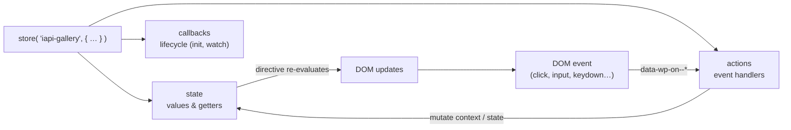
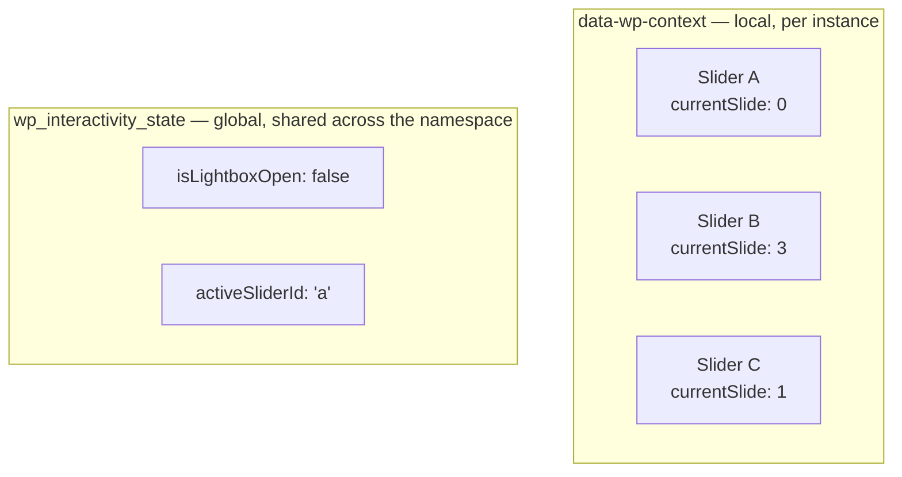
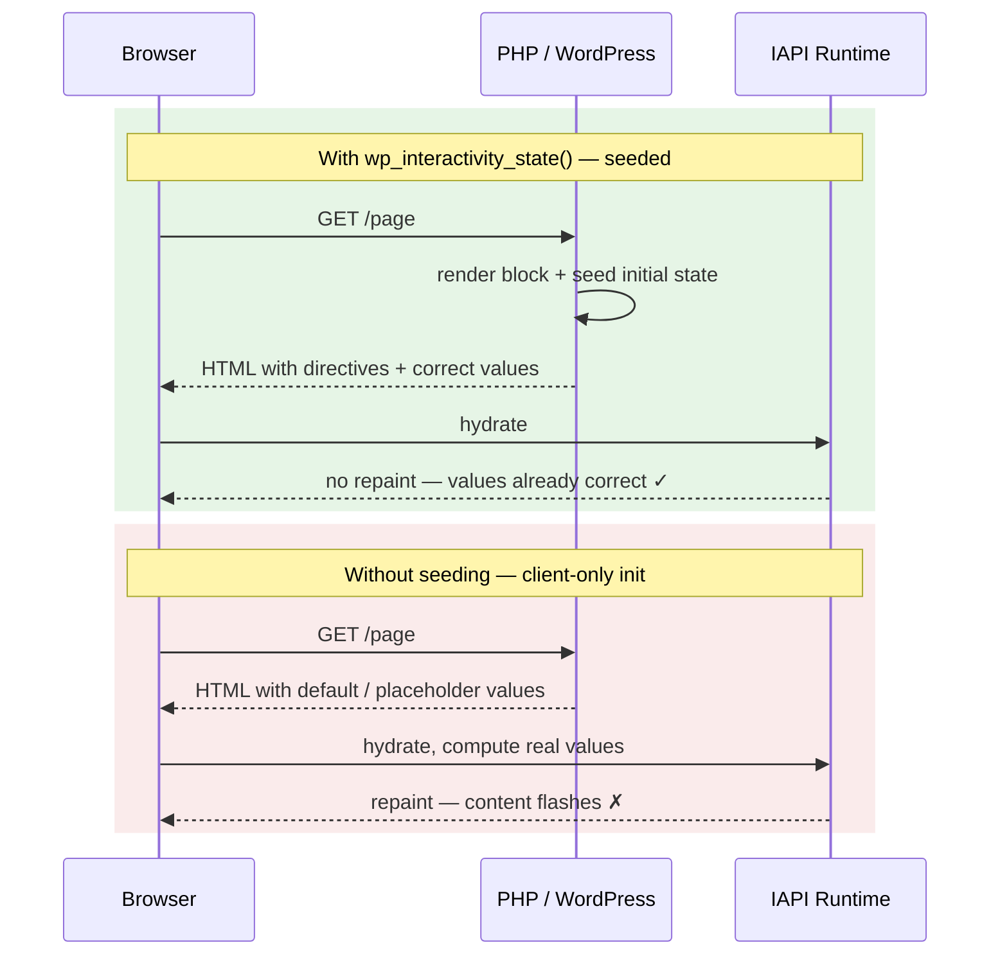

# Section 4 — Interactivity API Primer

**Type:** reading

## Goal

Build up the mental model we'll need before writing code: how directives, context, state, actions, and callbacks fit together, and how the server seeds initial state.

## Concepts

### 1. The two-part opt-in: `supports.interactivity` + `data-wp-interactive`

Before any directive does anything, two things have to be true:

1. **`"supports": { "interactivity": true }` in `block.json`** tells WordPress to enqueue the `@wordpress/interactivity` runtime on any page that renders this block, and to load `viewScriptModule` as an ES module. Without it, the runtime never reaches the page.
2. **`data-wp-interactive="<namespace>"` on an element in the rendered markup** tells that runtime "this element and its descendants are an interactive region bound to the store named `<namespace>`." It's the hydration root; it scopes every `data-wp-*` directive underneath it to the store we registered with the matching name in `view.js`.

You need both. The block.json flag loads the engine; the directive gives the engine a place to bind. We saw both in Section 2 — `supports.interactivity: true` in `src/block.json` and `data-wp-interactive='iapi-gallery'` on the wrapper in `src/render.php` — and we won't touch them again, but every directive in the table below depends on that pair being in place.

### 2. Directives at a glance

Directives are plain HTML attributes the Interactivity API runtime reads to bind the DOM to a store. They're how server-rendered markup "wakes up" on the client — no manual `querySelector` / `addEventListener` glue. Every directive on an element resolves its value against the **same store** that the nearest ancestor `data-wp-interactive` declares.

| Directive | Purpose | Tiny example |
|---|---|---|
| `data-wp-interactive` | Marks the root of an interactive region and binds it to a namespaced store | `
` |
| `data-wp-context` | Seeds **local** state for this instance (JSON) | `data-wp-context='{"currentSlide":0}'` |
| `data-wp-on--<event>` | Wires a DOM event to a store action | `data-wp-on--click="actions.nextImage"` |
| `data-wp-text` | Binds the text content of an element to a value | `

` |
| `data-wp-bind--<attr>` | Binds an HTML attribute to a store getter | `data-wp-bind--hidden="!state.isOpen"` |
| `data-wp-style--<prop>` | Sets an inline style from a getter | `data-wp-style--transform="state.translate"` |
| `data-wp-class--<name>` | Toggles a class from a getter | `data-wp-class--is-active="state.isActive"` |
| `data-wp-init` | Runs a callback once on hydration (we'll use this in Section 8) | `data-wp-init="callbacks.initSlideShow"` |

### 3. The `store()` shape — `state` / `actions` / `callbacks`

A store has three branches. **State** holds values (often getters) the DOM reads. **Actions** are the functions DOM events call. **Callbacks** run at lifecycle moments — hydration, or when a watched value changes.

The loop is always the same: an event fires an action, the action mutates state, directives bound to that state re-evaluate, and the DOM updates.

### 4. Local context vs global state

**Context** is local to one interactive region — every `data-wp-context` on the page gets its own copy. Two sliders on the same page each have their own `currentSlide`. **State** is global to the namespaced store — every region sharing the namespace sees the same value. Use context for "this widget's data" and state for "things the whole page agrees on."

Rule of thumb: if you'd be sad when two copies disagreed, it's state. If each copy *should* have its own value, it's context.

### 5. Server-seeded state prevents content flash

If the initial values only exist in JavaScript, the browser paints the markup *before* the runtime hydrates — and the user sees the wrong thing for a frame or two. `wp_interactivity_state()` lets PHP hand the runtime the right values up front, so the first paint is already correct.

We'll see each of these show up in the coding sections that follow — this is just the map before we start moving.

## What's Next

→ [Section 5 — Hello, Store](./section-5.md)
